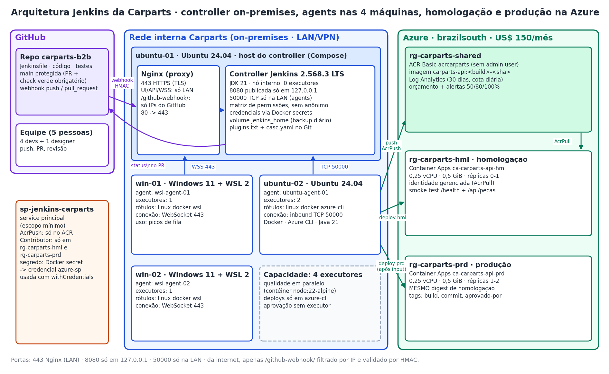
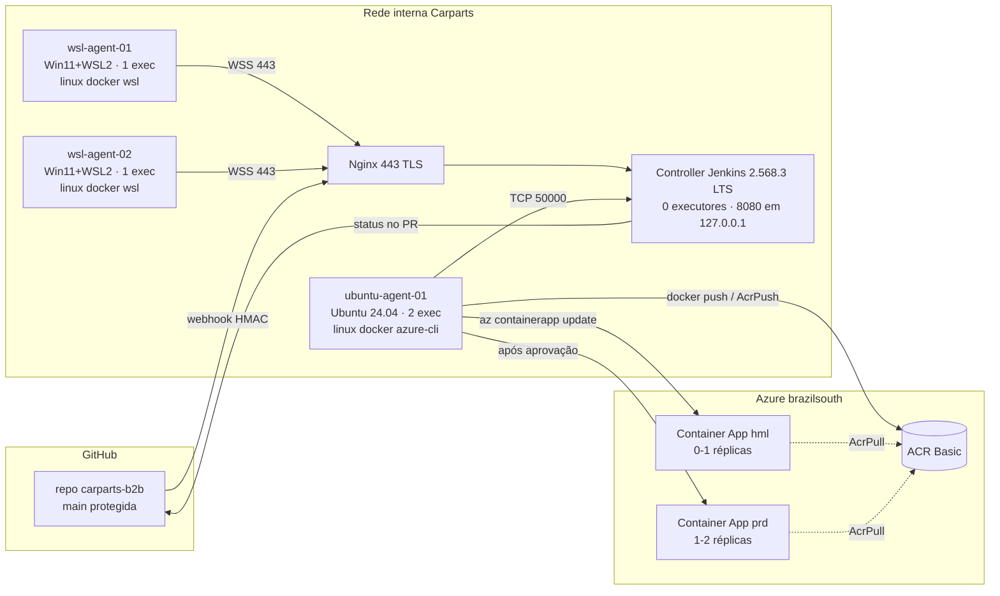

# E1 · Arquitetura Jenkins da Carparts

## Nós, executores, rótulos e portas

| Nó | Máquina / SO | Onde roda | Executores | Rótulos | Conexão |
|---|---|---|---|---|---|
| Controller (built-in) | ubuntu-01 · Ubuntu 24.04 | contêiner `jenkins/jenkins:2.568.3-lts-jdk21` (Compose) | **0** | `controller-nao-usar` | 8080 só em 127.0.0.1; Nginx 443 (LAN); 50000 (LAN) |
| ubuntu-agent-01 | ubuntu-02 · Ubuntu 24.04 | serviço systemd (agent.jar, Java 21) | 2 | `linux docker azure-cli` | inbound TCP 50000 |
| wsl-agent-01 | win-01 · Windows 11 + WSL 2 | Ubuntu 24.04 no WSL, systemd | 1 | `linux docker wsl` | inbound WebSocket 443 |
| wsl-agent-02 | win-02 · Windows 11 + WSL 2 | Ubuntu 24.04 no WSL, systemd | 1 | `linux docker wsl` | inbound WebSocket 443 |

## Decisão de hospedagem (resumo)

| Critério | A · Controller on-prem em Docker (**escolhido**) | B · Controller em VM Azure B2s | C · Jenkins no AKS |
|---|---|---|---|
| Restrição "ERP on-premises" | atende | exige VPN site-to-site até o ERP | exige VPN + cluster |
| Custo Azure/mês (estimado) | ~US$ 0 para o Jenkins | ~US$ 45-70 (VM + disco + IP + backup) | > US$ 150 (2 nós + LB) |
| Exposição | nada público além do webhook filtrado | IP público/Bastion a gerir | ingress público a gerir |
| Operação | equipe já usa Docker (Aula 02) | patches da VM | exige domínio de Kubernetes |
| Risco | máquina física única -> backup diário do volume | dependência de internet | complexidade |
